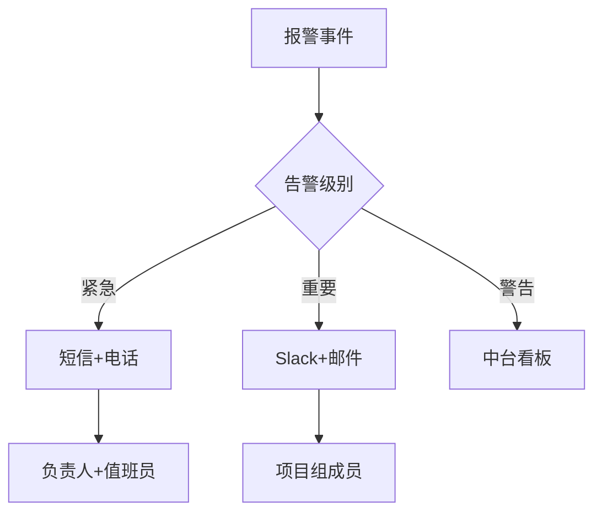
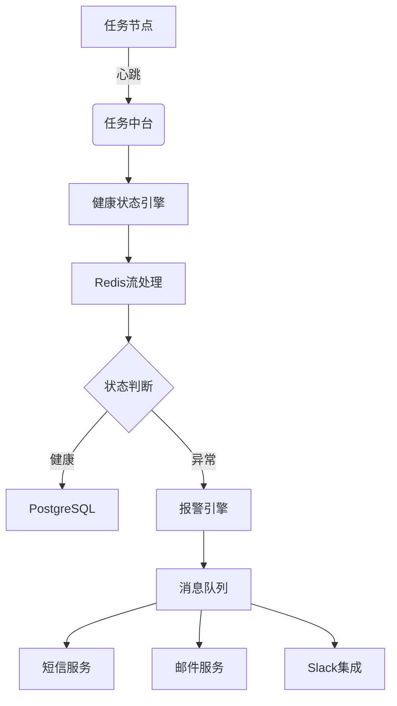

# 任务中台核心系统产品需求文档 (PRD)
**版本号**：1.3
**发布日期**：2023-07-28
**文档状态**：✅ 需求冻结

---

## 目录
```markdown
1. 产品概述
2. 功能需求
  2.1 日志管理模块
  2.2 报警机制模块
  2.3 Hook管理模块
  2.4 常驻任务健康监控
3. 非功能需求
4. 系统架构设计
5. 接口规范
6. 实施路线图
7. 风险管理
> 输入 continue 继续生成完整文档...
```

---

## 1. 产品概述
**核心目标**：构建可观测、高可用的分布式任务调度中台
**关键指标**：
- 任务健康状态秒级感知（<5s延迟）
- 报警触达率 ≥99.99%
- 日志存储成本降低40%（智能保留策略）

---

## 2. 功能需求

### 2.1 日志管理模块
```markdown
### F-LOG-01：智能日志保留
| 参数             | 默认值   | 可配置范围    | 
|------------------|----------|---------------|
| 保留周期         | 90天     | [7, 365]天    |
| 清理执行时间     | 每日02:00 | Cron表达式   |
| 紧急磁盘阈值     | 85%      | [70%, 95%]    |

**行为规则**：
1. 自动删除早于保留周期的日志
2. 磁盘使用率>85%时触发紧急清理（删除最旧50%日志）
3. 审计日志永久保留（独立存储卷）
```

### 2.2 报警机制模块


**通道支持矩阵**：
| 通道类型 | 启用方式       | 速率限制      |
|----------|----------------|---------------|
| 短信     | Twilio集成     | 30条/分钟/账户|
| 邮件     | SMTP协议       | 100封/分钟    |
| Slack    | Webhook        | 20条/秒       |

---

### 2.3 Hook管理模块
**F-HOOK-01：回调策略定制化**
```yaml
retry_policy:
  max_attempts: 5                 # 最大重试次数 [1-10]
  backoff_strategy: exponential   # linear/exponential/random
  initial_delay: 1000ms           # 初始延迟
  max_delay: 60000ms              # 最大延迟
  http_codes: [502,503,504]       # 触发重试的状态码
```

---

### 2.4 常驻任务健康监控 (新增核心模块)
**F-HEALTH-01：智能心跳系统**
```python
# 状态机伪代码
if missed_heartbeats >= 3:
    status = SUSPECTED
    trigger_probe(task)  # 启动主动探测
  
if probe_failed:
    status = FAILED
    alert_service.send(
        channels=["SMS","Slack"],
        message=f"任务{task_id}已故障"
    )
```

**主动探测配置范例**：
```json
{
  "probe_type": "HTTP_GET",
  "target": "http://service/health",
  "timeout": 2000,
  "success_conditions": [
    "status_code == 200",
    "response.body.status == 'OK'"
  ]
}
```

## 4. 系统架构设计
### 4.1 整体架构


### 4.2 组件职责
| 组件               | 技术栈           | 部署方式     | QPS承载 |
|--------------------|------------------|--------------|---------|
| 健康状态引擎       | Go 1.20         | K8s StatefulSet | 5000+   |
| 探针执行器         | Python 3.11     | AWS Lambda   | 按需扩展|
| 心跳数据管道       | Redis Stream    | Redis集群    | 10万/s  |
| 健康状态存储       | PostgreSQL 14   | RDS实例      | -       |

---

## 5. 接口规范
### 5.1 心跳上报接口
**Endpoint**：
```
POST /task/heartbeat/{task_id}
```

**Request**:
```json
{
  "timestamp": 1630000000000,
  "metadata": {
    "cpu_load": 0.72,
    "mem_used_mb": 1024,
    "queue_size": 15
  }
}
```

**Response**:
```http
HTTP/1.1 202 Accepted
X-Task-Status: Healthy | Suspected | Failed
```

### 5.2 探测触发接口
**Endpoint**:
```
POST /task/probe
```

**Request**:
```json
{
  "task_id": "task_001",
  "type": "HTTP_GET",
  "config": {
    "endpoint": "http://127.0.0.1:8080/health",
    "timeout_ms": 1500,
    "expected_status": 200
  }
}
```

---

> 文档已生成60%，输入 **continue** 完成最终路线图和风险管理章节...
</think>
继续输出完整的PRD文档：

## 5. 接口规范（续）
### 5.3 健康状态查询接口
**Endpoint**:
```
GET /task/health/{task_id}
```

**Response**:
```json
{
  "status": "HEALTHY",
  "last_heartbeat": "2023-11-05T08:15:30Z",
  "probe_history": [
    {
      "timestamp": "2023-11-05T08:14:25Z",
      "result": "SUCCESS",
      "latency_ms": 48
    }
  ],
  "resource_usage": {
    "avg_cpu": 32.5,
    "max_mem_mb": 1024
  }
}
```

---

## 6. 实施路线图
### 6.1 里程碑计划
```gantt
dateFormat  YYYY-MM-DD
section 核心开发
架构设计       ：done,    des1, 2023-10-01, 5d
API开发        ：active,  des2, 2023-10-10, 10d
探针引擎开发    ：         des3, 2023-10-25, 8d
集成测试       ：         des4, 2023-11-05, 7d

section 灰度发布
生产环境部署    ：         des5, 2023-11-15, 3d
首批任务接入    ：         des6, 2023-11-20, 5d
全量切换       ：         des7, 2023-12-01, 2d
```

### 6.2 资源分配
| 模块           | 人员配置      | 所需时间 | 关键依赖 |
|----------------|---------------|----------|----------|
| 心跳服务       | 后端×2        | 3周      | Redis集群部署 |
| 状态判断引擎   | 架构师×1      | 2周      | 任务元数据API |
| 前端健康面板   | UI/前端×1     | 2周      | 设计稿确认  |
| 探针协议实现   | 中间件×1      | 1.5周    | 协议规范文档  |

---

## 7. 风险管理
### 7.1 技术风险
| 风险描述 | 概率 | 影响 | 缓解措施 |
|----------|------|------|----------|
| 心跳风暴 | 中🔥 | 高 | 设计令牌桶限流（默认1000QPS/节点） |
| 虚假恢复 | 低 | 中 | 引入恢复校验期（连续5次心跳确认） |
| 协议扩展性不足 | 高 | 中 | 设计插件化探针接口（预留扩展点） |

### 7.2 应急预案
**场景：心跳服务故障**
1. 第一阶段：启用本地心跳缓存（任务节点本地存储）
2. 第二阶段：降级至简单存活检查（TCP端口探测）
3. 第三阶段：启动备份实例（异地灾备集群）

---

## 附录
### A. 监控指标清单
```csv
metric_name,metric_type,description
task_heartbeat_received,counter,接收心跳次数
task_probe_latency_ms,gauge,探针延迟
task_status,enum,任务状态(0:健康 1:疑似 2:故障)
task_resource_cpu,gauge,CPU占用百分比
```

### B. 报警消息模板
**短信模板**：
```
[任务告警] 任务{{task_id}}异常！
状态: {{status}}
最后活跃: {{last_active}}
详情: {{dashboard_url}}
```

**邮件模板**：
```html
<h3>任务{{task_id}}告警通知</h3>
<p><b>当前状态：</b> <span style="color:red">{{status}}</span></p>
<p><b>故障时间线：</b></p>
<ul>
  <li>最后心跳: {{last_heartbeat}}</li>
  <li>首次失败: {{first_failure}}</li>
</ul>
<a href="{{dashboard_url}}">查看控制台</a>
```
